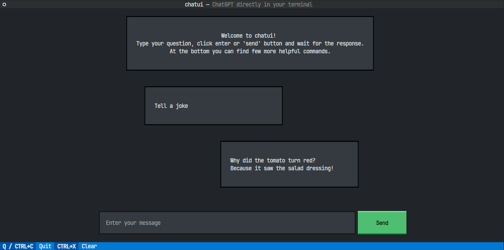

# 📬 chatui

[](https://www.python.org/)
[](https://github.com/python/black)
[](https://github.com/pre-commit/pre-commit)
[](https://mypy-lang.org/)
[](https://github.com/charliermarsh/ruff)



## 📝 Table of Contents

- [About](#about)
- [Installation](#installation)

## 📖 About <a name = "about"></a>

In-terminal ChatGPT powered by Textual.

## 💾 Installation <a name = "installation"></a>

Create a new virtual environment (assuming you already have Python installed e.g. via `pyenv`)

```bash
python -m venv venv
```

Activate it

```bash
source ./venv/bin/activate
```

Install requirements for local setup

```bash
pip install -r ./requirements/dev.txt
```

Get your OpenAI API key ([link](https://platform.openai.com/account/api-keys)) and set it as an environment variable

```bash
export OPENAI_KEY=<key>
```

You now be able to run the project

```bash
make run
```
